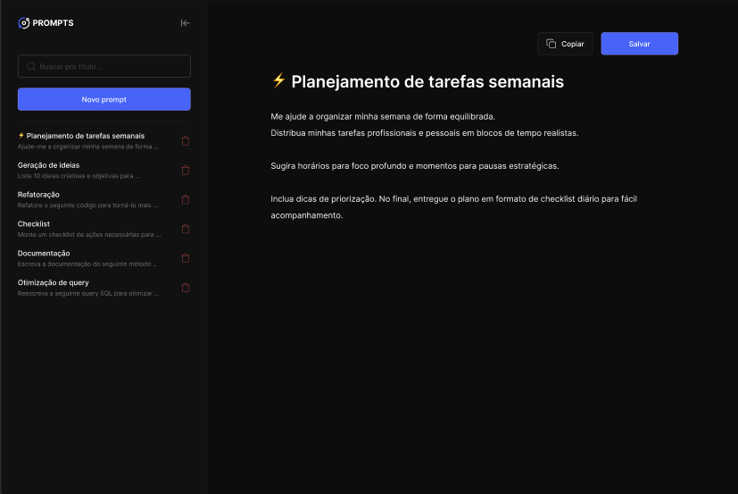

# 🎉 Prompts-Manager 

💻 Projeto
O Prompt Manager é um projeto desenvolvida na Next Level Week da Rocketseat. A aplicação tem oo objetivo de salvar os prompts em um único lugar
para serem utilizado posteriormente pelo usuário.  

---

## 💻 Tecnologias Utilizadas
- HTML5
- CSS3
- JAVASCRIPT
- GITHUB COPILOT

